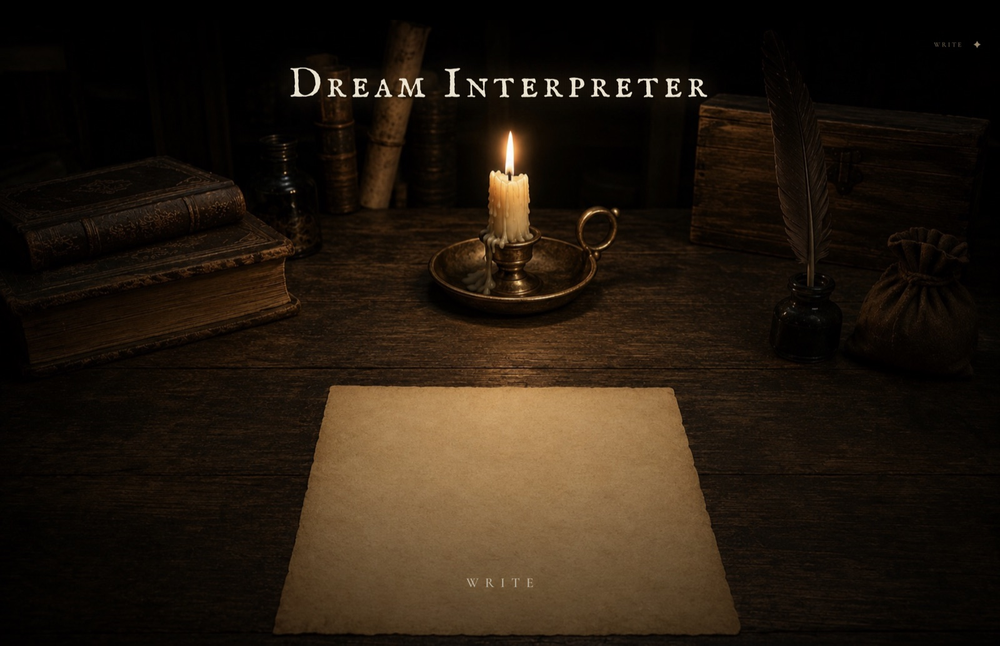

# 🌙 Dream Interpreter

An atmospheric web app where you sit at a candlelit desk and write a dream by quill‑light. Seal it, and the words glow and burn away as a grounded, **sourced** interpretation takes their place — drawn from real dream‑psychology frameworks, never invented.

**Live:** [https://dream-interpreter-coral.vercel.app](https://dream-interpreter-coral.vercel.app)



## The experience

- **You open on a desk at night** — an old wooden desk, books, a quill and inkwell, a lit candle, lit only by candlelight.
- **Lean in** to a sheet of aged parchment and **write your dream** with a quill cursor.
- **Seal it.** The written words glow as golden outlines of light, dissolve, and the interpretation unrolls in their place on the same sheet.
- **Two hours of the same night** — a subtle settings toggle shifts between **Nightfall** (candlelit) and **Daybreak** (morning fog).
- **Enter the dream again** — a calm, hypnotic drift (the dream symbols rise from the page as you fall under) into a dream space *(in progress)*.

## How the interpretation works

1. **You describe a dream** on the parchment.
2. **Symbol matching** finds relevant dream symbols (water, being chased, teeth falling out, etc.) in your text.
3. **Knowledge‑base retrieval** gathers sourced perspectives from established psychological frameworks (Jungian, Continuity Hypothesis, Threat‑Simulation Theory, sleep science, etc.).
4. **Groq LLM** phrases those perspectives into a personal, readable interpretation — **grounded only in what's in the knowledge base**, never inventing meanings.
5. **You get a reflection** with attributed frameworks, the matched symbols, and a gentle question to sit with.

## Why this approach?

Dream interpretation is **not settled science** — there's no authoritative "water = X" lookup table. Instead, this app presents **credible, sourced perspectives** from real psychological theories, each attributed to its framework. The interpretation is honest: *"In Jungian theory, water often represents…"* — not *"Your dream means…"*

## Tech stack

- **Framework:** Next.js 16 (App Router) + React 19 + TypeScript
- **Styling:** a hand‑written CSS design system — every adaptive value is a CSS custom property driven by a `[data-mode]` attribute (Nightfall / Daybreak); Tailwind v4 is present only for the base reset
- **Type:** Cormorant Garamond + EB Garamond, with IM Fell English SC (an 1800s revival) for the title
- **LLM:** Groq (free tier, easily upgradeable to a premium LLM); the key stays server‑side
- **Knowledge base:** local JSON (`data/frameworks.json`, `data/symbols.json`)
- **Assets:** a composed scene photo plus separate desk / candle / paper layers, a film‑grain SVG, and a quill cursor — all in `public/`
- **Hosting:** Vercel (auto‑deploys from GitHub)

## Project structure

```
dream_interpreter/
├── app/
│   ├── page.tsx                 # The experience: desk scene, camera views,
│   │                            #   writing, glow→erase reveal, the faint
│   ├── layout.tsx               # Fonts + root layout (data-mode on <body>)
│   ├── globals.css              # The design system: tokens, dual modes, the
│   │                            #   scene, paper, candlelight, animations
│   └── api/interpret/route.ts   # Server route: matches symbols, calls Groq
├── lib/
│   └── knowledge.ts             # Symbol matching + knowledge-base retrieval
├── data/
│   ├── frameworks.json          # Dream-psychology theories, with sources
│   └── symbols.json             # Dream symbols, each per-framework annotated
└── public/
    ├── scene.jpg                # Composed candlelit desk (opening backdrop)
    ├── desk.jpg, paper.jpg, candle.png   # Scene layers
    └── quill-cursor.svg, noise.svg       # Quill cursor + film grain
```

## Local development

### Prerequisites
- Node.js 18+
- A free Groq API key from [https://console.groq.com/keys](https://console.groq.com/keys)

### Setup

1. Clone the repo
   ```bash
   git clone https://github.com/jjcoasiss71/dream_interpreter.git
   cd dream_interpreter
   ```

2. Install dependencies
   ```bash
   npm install
   ```

3. Create `.env.local` and paste your key
   ```bash
   echo 'GROQ_API_KEY=your_actual_key_here' > .env.local
   ```
   *(This file is git‑ignored — your key never leaves your computer.)*

4. Start the dev server
   ```bash
   npm run dev
   ```
   Open [http://localhost:3000](http://localhost:3000)

## Grow the knowledge base

The knowledge base lives in **data/** as JSON. Add symbols or frameworks anytime — the app picks them up automatically, no code changes needed.

### Add a new symbol

Edit `data/symbols.json` and add an entry with `id`, `label`, `aliases`, and `perspectives`:

```json
{
  "id": "drowning",
  "label": "Drowning",
  "aliases": ["drowning", "suffocating", "underwater"],
  "perspectives": [
    {
      "framework": "continuity-hypothesis",
      "meaning": "May reflect waking feelings of being overwhelmed.",
      "source": "Domhoff, G. W. (2003). The Scientific Study of Dreams."
    }
  ]
}
```

Commit and push — Vercel auto‑deploys within seconds.

## Deployment

Deployed on **Vercel** — auto‑syncs with GitHub. Every push to `main` rebuilds and deploys. Set `GROQ_API_KEY` in the Vercel project settings (Settings → Environment Variables, for Production and Preview).

## Honesty & responsibility

This app is for **reflection, not diagnosis.** Dream interpretation is subjective. Every idea is attributed to its source framework. No medical or psychological claims.

## License

MIT

---

See the [project plan](./Dream%20Interpreter%20—%20Project%20Plan.md) and the [immersive UI roadmap](./Dream%20Interpreter%20—%20Immersive%20UI%20Roadmap.md) for fuller context.
